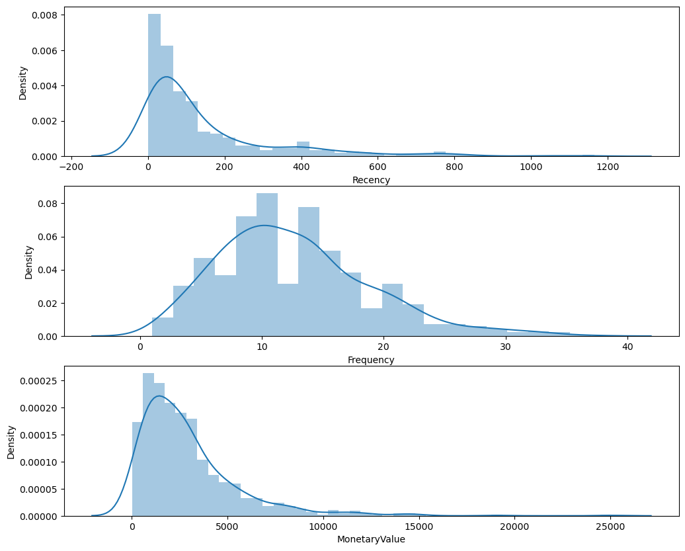
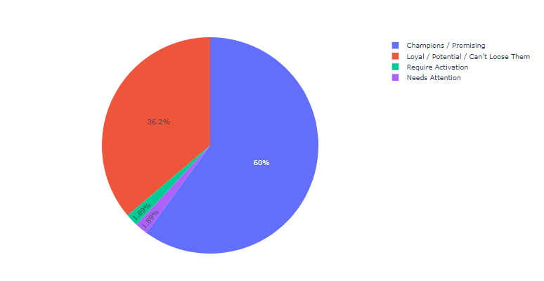

# Data Insights Pipeline: SuperStore Analysis

## Overview

The project at hand revolves around the creation of a robust data transformation and analysis pipeline for a fictional company, leveraging data from its Microsoft SQL Server database named "SuperStore." This pipeline aims to extract, transform, and analyze data to derive actionable insights, support decision-making processes, and drive business growth.

## Objective:

The primary objective of the project is to establish an efficient and scalable data processing pipeline that enables the company to:

1. Extract relevant data from the SuperStore SQL Server database.
2. Clean, transform, and enrich the extracted data to make it suitable for analysis.
3. Store the processed data in a structured manner for easy access and retrieval.
4. Utilize data visualization techniques to gain insights and communicate findings effectively.
5. Develop and train machine learning models to predict future outcomes and optimize business operations.

# Project Architecture

The project follows a Architecture, as below:

# Architecture

The project architecture is the structural design that outlines how data is collected, processed, stored, and utilized within a system. In the context of this specific project, the architecture revolves around handling data from a Microsoft SQL Server database called "SuperStore" using Python notebooks (Jupyter notebooks), storing it at different stages of transformation (Bronze, Silver, and Gold), and employing it for data visualization and machine learning tasks.

## Components of the Project Architecture:

1. **Data Source: Microsoft SQL Server (SuperStore)**:
   - This is the primary repository of the project's raw data. It contains tables with information about orders, customers, products, and sales transactions.

2. **ETL Process: Python Notebooks (Jupyter Notebooks)**:
   - Python notebooks, specifically Jupyter notebooks, are utilized for the Extract, Transform, Load (ETL) process. These notebooks provide an interactive environment where Python code can be written and executed to extract data from the SQL Server database, transform it according to predefined rules, and load it into different storage layers.

      a).  **Data Scrapping:**
         Data is extracted from the MS SQL Database using Python scripts.
         Raw data is stored in the `DataStorage/Bronze` folder in parquet format.
      
      b).  **Data Cleaning (Silver):**
         Duplicates are treated, missing values are handled, and noise data is checked.
         Cleaned data is saved in the `DataStorage/Silver` folder in parquet format.
      
      c).  **Data Transformation (Gold):**
         Further data transformation is performed, resulting in the final format.
         Transformed data is saved in the `DataStorage/Gold` folder in parquet format.

3. **Storage Layers: Bronze, Silver, and Gold**:
   - **Bronze Layer**:
     - Initial storage layer where raw data from the SQL Server database is stored without any modifications.
   - **Silver Layer**:
     - Intermediate storage layer where data undergoes transformation, cleaning, and enrichment processes. New columns are added, and calculations are performed to prepare the data for analysis.
   - **Gold Layer**:
     - Final storage layer where processed data, along with the results of machine learning analyses, is stored. This layer serves as the foundation for generating insights and making data-driven decisions.

4. **Data Visualization Tool: Tableau**:
   - Tableau is utilized for creating visualizations, dashboards, and reports based on the processed data. It provides an intuitive interface for exploring data, identifying trends, and communicating insights effectively to stakeholders.

5. **Machine Learning Models**:
   - Processed data from the Gold layer is used to develop and train machine learning models. These models are capable of making predictions, detecting patterns, and classifying data based on historical observations.

## How the Project Architecture Works:

1. **Data Extraction**:
   - Python notebooks connect to the Microsoft SQL Server database and extract relevant data from the SuperStore tables.

2. **Data Transformation**:
   - Extracted data undergoes transformation processes within the Jupyter notebooks. This includes cleaning, restructuring, and enriching the data to make it suitable for analysis and modeling.

3. **Data Storage**:
   - Transformed data is stored in different storage layers:
     - Bronze: Raw data storage.
     - Silver: Processed data storage after transformation.
     - Gold: Final processed data storage after applying machine learning algorithms.

4. **Data Utilization**:
   - Processed data from the storage layers is utilized for various purposes:
     - Data visualization using Tableau to gain insights and communicate findings.
     - Development and training of machine learning models for predictive analytics and decision support.

## Benefits of the Project Architecture:

- **Scalability**: The architecture is designed to handle large volumes of data and can scale as the project requirements evolve.
- **Flexibility**: Using Python notebooks for ETL processes provides flexibility in data manipulation and transformation.
- **Interactivity**: Jupyter notebooks allow for interactive exploration and experimentation with data transformation techniques.
- **Insight Generation**: By leveraging Tableau for data visualization and machine learning models for predictive analytics, the architecture facilitates insight generation and informed decision-making.

# Machine Learning Algorithm

This GitHub repository includes machine learning algorithms, such as RFM (Recency, Frequency, and Monetary) analysis, implemented to identify loyal customers. Python scripts within the ML_Models folder are dedicated to implementing these machine learning algorithms and grouping customers based on their behavior.

## RFM Analysis

### Overview
- RFM (Recency, Frequency, and Monetary) analysis is a powerful method used to segment customers based on their transaction history.
- It evaluates:
  - Recency: How recently a customer made a purchase.
  - Frequency: How often a customer makes purchases.
  - Monetary: How much money a customer spends.
     

### Implementation
- Python scripts within the ML_Models folder implement RFM analysis to categorize customers into different groups based on their RFM scores.
- These scores help identify loyal customers who contribute significantly to the business's revenue.

## Pareto Principle (80/20 Rule)

### Observation
- According to the Pareto Principle, 36% of customers contribute to 61% of business revenue.
- Only 1.9% of customers contribute negligibly to the business's revenue, with their RFM scores falling below a certain threshold.
- While this reflects the Pareto rule, we leverage it to optimize business strategies and improve profitability.

   

# Low RFM Value Customers

## Strategies

### Customer Understanding
- Gain insights into the needs and preferences of low RFM value customers through additional data analysis and customer feedback.

### Tailored Approach
- Tailor products, services, and marketing efforts to meet the specific needs of low RFM value customers, aiming to increase their engagement and loyalty.

### Customer Experience Improvement
- Focus on improving the overall customer experience for low RFM value customers, addressing any pain points or areas of dissatisfaction to encourage repeat business.

# HIgh RFM Value Customers
## Recommendations

### Loyalty Program Development
- Develop a loyalty program tailored to high-value customers identified through RFM analysis.
- Offer exclusive deals, discounts, and rewards to incentivize repeat purchases and foster customer loyalty.

### Upselling and Cross-Selling
- Implement upselling and cross-selling strategies to increase the average order value among high-value customers.
- Recommend complementary products or upgrades to encourage additional purchases.

### Referral Programs
- Request referrals from high-value customers and reward them for bringing in new business.
- Encourage satisfied customers to spread the word and attract new customers to the business.

By leveraging machine learning algorithms and the insights derived from RFM analysis and the Pareto Principle, businesses can implement targeted strategies to optimize customer engagement, increase revenue, and foster long-term relationships with their most valuable customers.

# Tableau Dashboard
- A Tableau dashboard is created to visualize insights derived from the data analysis.
- The Tableau dashboard files are located in the `Tableau_Dashboard` folder.

 
 

 ## Tableau Dashboard Insights

This GitHub repository contains Tableau dashboard files showcasing insightful visualizations derived from comprehensive data analysis. The Tableau dashboard files are located in the "Tableau Dashboard" folder within this repository.

## Insights Overview

### Customer Strength
- The business boasts a robust customer base of 793 individuals, indicating a strong market presence.

### Total Orders
- A significant volume of 5009 orders has been processed, showcasing a substantial demand for the products or services.

### Total Quantity Sold
- The business has successfully moved 37,989 units, underscoring a considerable level of product adoption.

### Revenue
- Achieving a noteworthy revenue of $2,311,359 highlights the financial success of the business.

### Net Profit
- With a net profit of $289,778, the business demonstrates a healthy bottom line.

### Regional Sales Analysis
- Sales are particularly strong in states such as California, New York, Texas, and Washington, while North Dakota and South Dakota exhibit lower sales.

### Sales Forecasting Analysis
- Utilizing time series forecasting, the business predicts an upward trend in sales from July 2017 to October 2018, with a discernible yearly seasonality.

### Category Sales Distribution
- The three main categories (Technology, Office Supplies, Furniture) contribute equally to the overall sales, each ranging between 30-35%.

### Customer Tenure Analysis
- The tenure of customers follows a negative distribution, indicating a varied range of customer relationships.

### Order Size Distribution
- Small-sized orders dominate the distribution, followed by medium-sized orders, with larger orders being less common.

### Product Profitability Analysis
- High-profit items include copper, phones, and accessories. Moderate profits are observed in paper, binders, and chairs. However, there are notable losses associated with supplies, bookcases, and tables.

## Business Optimization Suggestions

### Target Marketing Efforts
- Focus marketing campaigns in states with higher sales to maximize reach and impact.

### Supply Chain Efficiency
- Optimize inventory and supply chain processes to meet the demand reflected in the sales forecast.

### Customer Relationship Management
- Leverage insights from customer tenure analysis to tailor retention strategies for different customer segments.

### Product Mix Adjustment
- Evaluate the profitability of products and consider adjusting the product mix to emphasize high-profit items and reduce reliance on less profitable products.

### Promotional Strategies
- Implement targeted promotions or discounts on categories with lower sales to stimulate customer interest and drive sales.

### Order Size Promotion
- Introduce incentives or promotions to encourage larger order sizes and increase overall transaction value.

### Cost Management
- Explore cost reduction strategies for products with high losses, ensuring a more sustainable profit margin.

